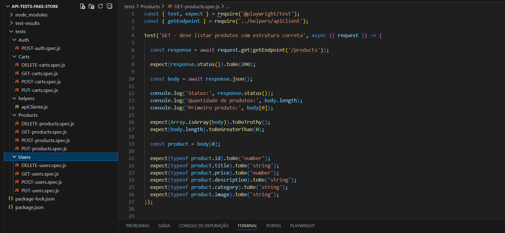

# 🧪 Automação de Testes de API | FakeStore

Este projeto consiste na automação de testes de uma API REST utilizando Playwright e Node.js.

Ele foi desenvolvido como parte do meu processo de aprofundamento em testes de API, com foco não apenas na execução de requisições, mas principalmente na compreensão do comportamento da aplicação, na organização da suíte e na construção de um raciocínio técnico estruturado.

A API utilizada foi a **[FakeStore API](https://fakestoreapi.com/docs)**, cuja documentação oficial serviu como base para entendimento dos endpoints, métodos disponíveis e estrutura das respostas.

Mais do que validar respostas 200, minha intenção foi entender como uma API deve funcionar, como organizar testes de forma coerente e como analisar criticamente aquilo que está sendo retornado.

---

# 📌 Sobre a FakeStore API

A FakeStore é uma API pública que simula um e-commerce, oferecendo recursos como:

- Products  
- Carts  
- Users  
- Auth  

Cada um desses recursos representa uma entidade do sistema e pode ser manipulado por meio de métodos HTTP como GET, POST, PUT e DELETE.

Utilizei essa API como ambiente de prática para consolidar meu entendimento sobre arquitetura REST, comunicação cliente-servidor e testes automatizados voltados para validação de comportamento e estrutura.

---

# 🧠 Como Estruturei Meu Pensamento

Antes de sair escrevendo testes, organizei meu raciocínio em algumas etapas:

1. Entender a estrutura da API e seus recursos  
2. Compreender o comportamento esperado de cada método HTTP  
3. Definir cenários positivos e negativos para cada domínio  
4. Organizar a suíte de forma escalável  
5. Validar não apenas status code, mas também estrutura e tipagem  

Essa organização prévia me ajudou a evitar testes soltos e repetitivos, mantendo coerência entre intenção e implementação.

---

# 🔎 Entendimento de REST na Prática

Ao trabalhar com os endpoints, busquei reforçar o entendimento de que REST não é apenas uma convenção de URLs, mas um padrão arquitetural baseado em recursos e semântica de métodos.

- GET para recuperar dados  
- POST para criar  
- PUT para atualizar  
- DELETE para remover  

Compreender essa lógica foi essencial para estruturar corretamente os cenários de teste e saber o que deveria ser validado em cada operação.

---

# 📊 Interpretação de Status Code

Durante a implementação, dei atenção especial aos códigos de resposta retornados pela API.

Validei códigos como:

- 200 para sucesso  
- 201 para criação  
- 400 para requisição inválida  
- 401 para falha de autenticação  
- 404 para recurso inexistente  

Ao criar cenários negativos, identifiquei que a FakeStore não possui validações robustas. Em muitos casos, a API retorna 200 ou 201 mesmo com dados inválidos.

Essa constatação foi importante para diferenciar comportamento ideal de comportamento real. Em um ambiente corporativo, esses comportamentos seriam tratados como falhas de validação ou oportunidades de melhoria.

---

# ✅ Cenários Positivos e ❌ Cenários Negativos

Para cada recurso, defini uma quantidade equilibrada de casos que representassem:

- Fluxos esperados de sucesso  
- Situações de erro ou dados inconsistentes  

A escolha da quantidade de testes não foi aleatória. Busquei cobrir:

- Listagem de recursos  
- Busca por ID  
- Criação com dados válidos  
- Atualização  
- Exclusão  
- Tentativas com dados inválidos  

Criar cenários negativos foi uma decisão consciente. Mesmo quando a API não responde com erro adequado, manter esses testes demonstra entendimento de regra de negócio e pensamento crítico sobre validações.

---

# 🧩 Validação de Estrutura e Tipagem

Além de validar o status code, incluí validações estruturais:

- Verificação se a resposta é um array quando esperado  
- Confirmação da existência de propriedades obrigatórias  
- Checagem de tipos primitivos como string e number  
- Validação de objetos internos e estruturas aninhadas  

Essa prática é importante para garantir estabilidade de contrato e prevenir impactos em integrações futuras.

---

# 🏗 Organização da Suíte

Desde o início, minha preocupação foi estruturar o projeto de forma clara e escalável.

## Organização por Recurso

A estrutura foi dividida por domínio:

```
tests/
  Products/
  Carts/
  Users/
  Auth/
  helpers/
```

Essa separação facilita manutenção e leitura.

---

## Separação por Método

Dentro de cada recurso, os testes foram organizados por método HTTP:

- GET  
- POST  
- PUT  
- DELETE  

Essa divisão torna a navegação mais intuitiva e mantém o projeto organizado.

---

## Uso de Helper

Implementei um helper para centralizar a base da URL, evitando repetição e melhorando manutenção:

```javascript
function getEndpoint(path) {
  return `https://fakestoreapi.com${path}`;
}
```

---

## Questionamento Arquitetural

Durante o módulo de autenticação, observei que o login retorna um token, mas os demais endpoints não exigem autenticação.

Essa característica foi analisada como limitação da API, reforçando a importância de não apenas executar testes, mas também compreender arquitetura e segurança.

---

# 🛠 Ferramentas Utilizadas

- Node.js  
- Playwright Test  
- JavaScript  
- API REST  
- JSON  

---

# 🚀 Evidências de Execução

<details>
<summary>Clique para visualizar a execução dos testes</summary>


</details>

---

# 📂 Organização do Projeto

<details>
<summary>Clique para visualizar a estrutura do projeto</summary>



</details>

---

# 📚 Aprendizados

Este projeto me permitiu evoluir em:

- Entendimento prático de APIs REST  
- Interpretação consciente de status code  
- Construção estruturada de cenários positivos e negativos  
- Organização de suíte automatizada  
- Validação de estrutura e contrato  
- Capacidade de explicar decisões técnicas  

---

# 💬 Considerações Finais

Este projeto representa uma etapa importante do meu aprendizado em testes de API.

Durante o desenvolvimento, busquei não apenas automatizar requisições, mas entender o porquê de cada validação realizada, como organizar melhor uma suíte de testes e como analisar criticamente o comportamento de uma API pública.

Foi uma oportunidade de consolidar fundamentos e praticar organização, clareza e pensamento estruturado.